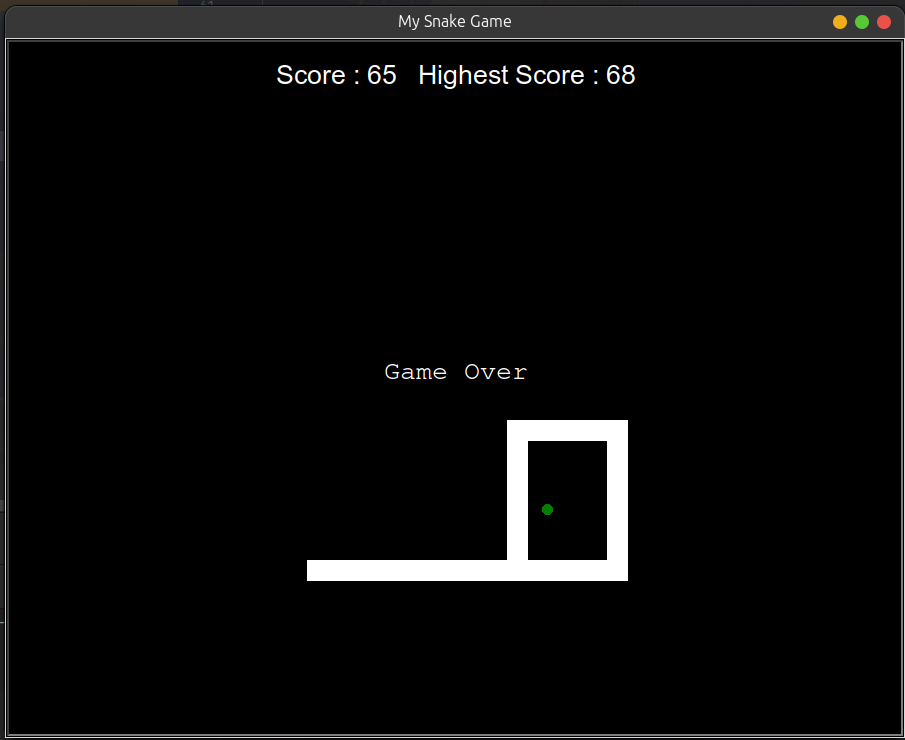

# Snake Game 🐍🎮
This project is a classic Snake game developed in Python, offering a fun and nostalgic gaming experience. The objective is to control the snake, collect food, and grow longer without running into walls or the snake's own body.

## Key Features:
-  Gameplay: Control the snake using arrow keys to navigate and collect food.
- Score Tracking: The game keeps track of your score as the snake grows longer.
- Game Over: The game ends if the snake runs into a wall or itself, challenging players to improve their skills.

### Technology Stack:
✅ Python | Turtle

